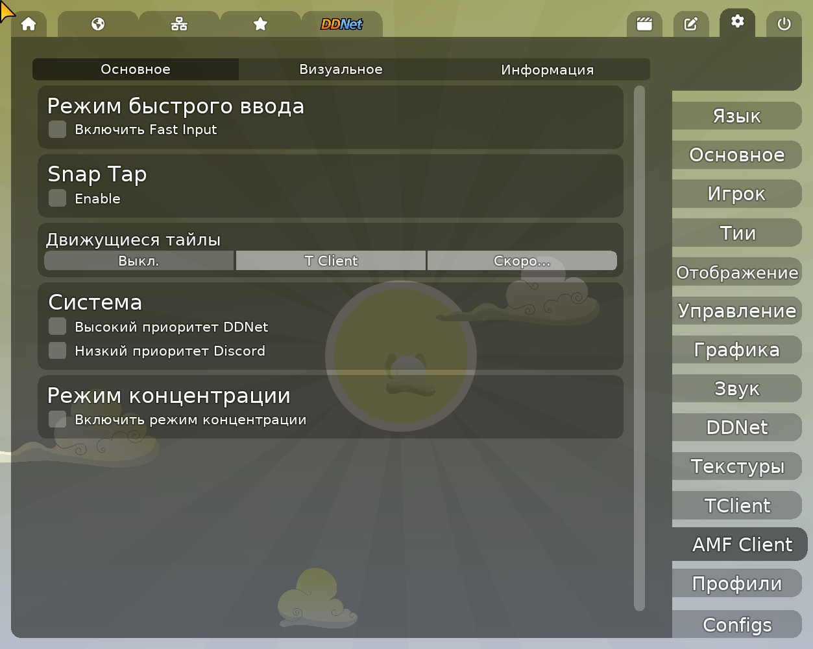
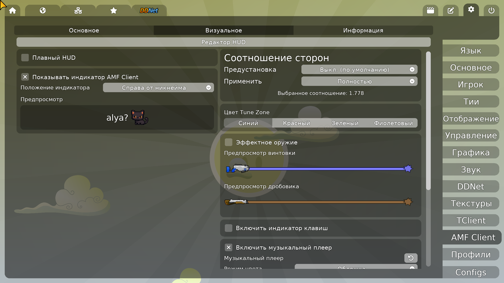
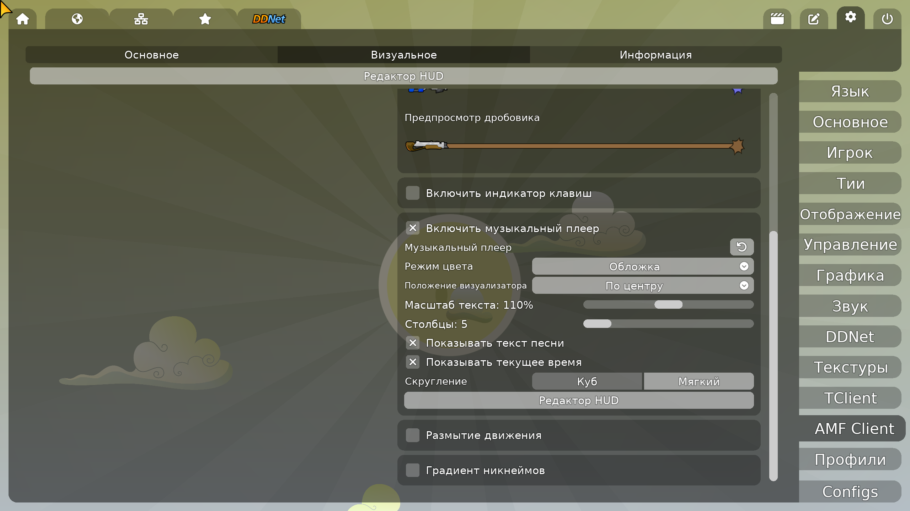

# AMF Client

> Неофициальный клиент DDNet с гибким HUD, игровыми инструментами и Music Player.

## О проекте

AMF Client построен на основе Best Client и DDNet. Это не просто набор скинов: у клиента есть собственные модули интерфейса, редактор HUD, предикт ввода, визуальные настройки и интеграция с медиаплеером. Он остаётся совместимым с серверами DDNet и не меняет правила игры.

> AMF Client не связан с официальной командой DDNet. Некоторые функции могут быть недоступны на серверах с ограничениями.

## Ссылки

- [Релизы AMF Client](https://github.com/AlyaDDNet/AMF-Client/releases)
- [Discord-сообщество](https://discord.gg/7zG28thvRV)
- [Инструкция по сборке](docs/BUILDING.md)

## Скриншоты

Снимки сделаны в текущей локальной сборке клиента.

### Настройки → AMF Client → Основное



### Настройки → AMF Client → Визуальное



### Music Player



## Главные возможности

| Music Player | Редактор HUD |
| --- | --- |
| - Название трека, обложка, таймер и визуализатор<br>- Текст песни и плавная смена строк<br>- На Linux: MPRIS-плееры, включая Spotify, VLC, mpv и браузерные медиа-сессии | - Перенос и масштабирование AMF-модулей прямо в игре<br>- Сохранение позиций каждого элемента<br>- Отдельная настройка Music Player, индикаторов и HUD |
| **Предикт ввода** | **Визуальная настройка** |
| - Fast, Best, Saiko, Saiko+, Delta, F, Cloud и Meow<br>- Auto Margin по задержке и джиттеру<br>- Snap Tap для противоположных направлений | - Плавные анимации интерфейса, чата и таба<br>- Градиенты никнеймов и командных цветов<br>- Соотношение сторон, эффекты оружия и Motion Blur |

## Обзор функций

### Визуальное

- Music Player: обложка или статичный цвет, масштаб текста, столбики и положение визуализатора, скругление, текст песни и текущее время.
- Плавный HUD и анимации меню, чата, таблицы счёта и стартового экрана.
- Индикатор AMF Client возле никнеймов и фильтр серверов с пользователями AMF Client.
- Настраиваемое соотношение сторон: пресеты, собственный размер и безопасное подтверждение перед применением.
- Градиентные никнеймы, командные цвета, эффекты винтовки и дробовика, движущиеся тайлы и Tune Zone.
- Индикаторы клавиш/мыши с CPS и стилями Default или Minecraft.
- Motion Blur на Vulkan.

### Игра

- Режимы предикта Fast, Best, Saiko, Saiko+, Delta, F, Cloud и Meow.
- Auto Margin для подстройки запаса предикта по сети.
- Snap Tap для приоритета последнего нажатого направления.
- Focus Mode: скрывает отвлекающие элементы по выбору — имена, эффекты, HUD, чат, таблицу счёта и музыкальный плеер.

### Вне меню

- Discord Rich Presence.
- Профили, конфиги, бинды и колесо биндов.
- Перевод чата.
- Скрипты ChaiScript. Они не запускаются в песочнице: используй только файлы, которым доверяешь.

## Где искать настройки

1. Открой **Настройки** через значок шестерёнки.
2. Справа выбери **AMF Client**.
3. **Основное** — ввод, Auto Margin, Snap Tap, Focus Mode и системные настройки.
4. **Визуальное** — HUD, Music Player, эффекты, индикаторы и соотношение сторон.
5. Для редактора HUD подключись к серверу и нажми **Редактор HUD**.

## Сборка

Сначала инициализируй подмодули:

```sh
git submodule update --init --recursive
```

Быстрая сборка клиента на Linux:

```sh
cmake -S . -B build -G Ninja
cmake --build build --target game-client -j"$(nproc)"
```

`$(nproc)` задействует все доступные ядра процессора.

Для полной Linux-интеграции Music Player поставь DBus и PulseAudio-совместимые библиотеки. С PipeWire визуализатор работает при включённом PulseAudio compatibility service.

- Debian/Ubuntu: `libdbus-1-dev libpulse-dev`
- Arch Linux: `dbus libpulse`
- Fedora: `dbus-devel pulseaudio-libs-devel`

Без этих библиотек клиент всё равно собирается, но часть возможностей Linux Music Player недоступна.

## Благодарности и лицензия

Спасибо авторам DDNet и Best Client за основу проекта, а также участникам и тестерам AMF Client.

Код DDNet/Teeworlds, сторонние библиотеки и ассеты сохраняют свои лицензии. Подробности — в [license.txt](license.txt) и файлах лицензий внутри соответствующих каталогов.
